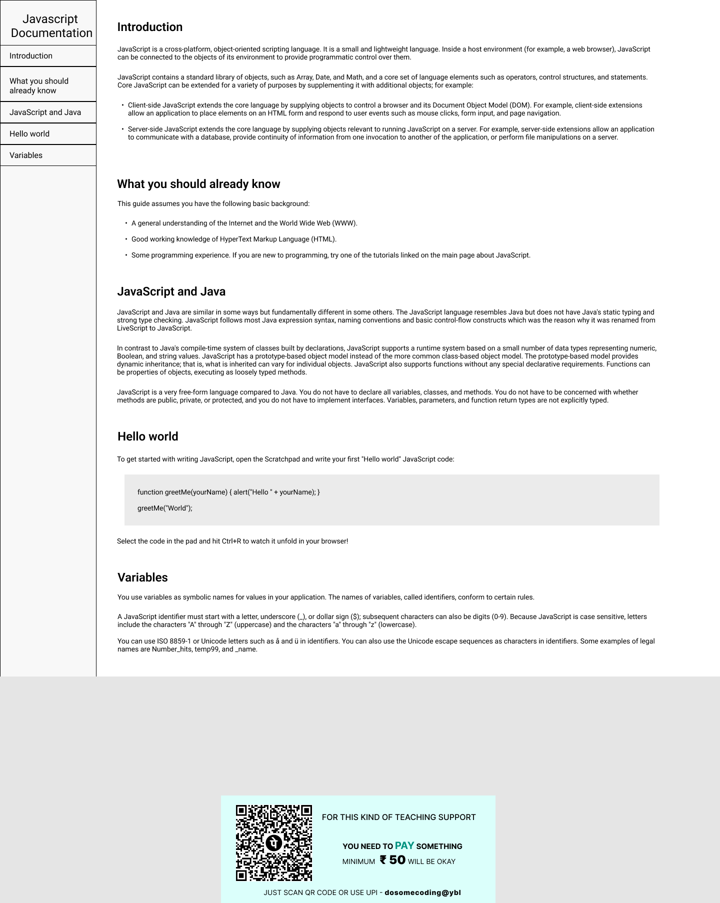

# Javscript-Documentation-Page-Using-HTML-CSS
I will take figma design of this project and Made this project for practising my HTML CSS skills feel free to see and practise it by your own
# JavaScript Documentation Website

## Description

This is a simple website for JavaScript documentation. It provides information about the introduction to JavaScript, what you should already know before diving into JavaScript, the difference between JavaScript and Java, how to write a "Hello World" program in JavaScript, and a brief explanation of variables in JavaScript.

## Features

- **Introduction Section:** The website opens with an introduction section that explains what JavaScript is and its key features. It covers its cross-platform, object-oriented scripting nature and its core set of language elements.

- **What You Should Already Know:** This section assumes the reader has some background knowledge, including a general understanding of the Internet and the World Wide Web, good working knowledge of HyperText Markup Language (HTML), and some programming experience.

- **JavaScript and Java:** This section highlights the similarities and differences between JavaScript and Java, emphasizing the absence of static typing and strong type checking in JavaScript.

- **Hello World Example:** The "Hello World" section provides a simple example of a JavaScript function to display an alert with a personalized greeting.

- **Variables:** This section explains the usage of variables in JavaScript, including the rules for declaring identifiers.

## Technologies Used

- **HTML5:** Used to create the structure and content of the website.
- **CSS3:** Employed for styling and layout, ensuring a clean and visually appealing design.

## Getting Started

To view this website locally, follow these steps:

1. Clone the repository.
2. Open the `index.html` file in your preferred web browser.

## Deployment

This project can be deployed using any web hosting service. Simply upload the files to your web server or use one of the recommended hosting providers like GitHub Pages, Vercel, or Netlify.

## Contributions

Contributions and feedback are welcome! Feel free to open an issue or create a pull request.

## License

This project is licensed under the [MIT License](LICENSE).
